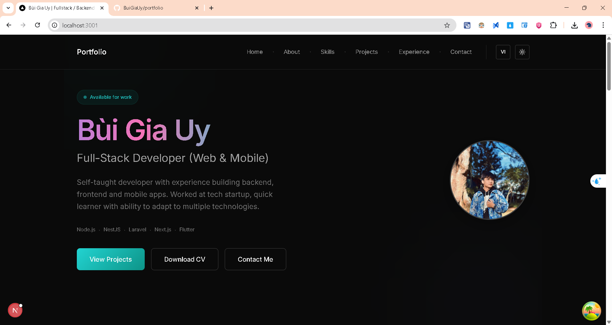
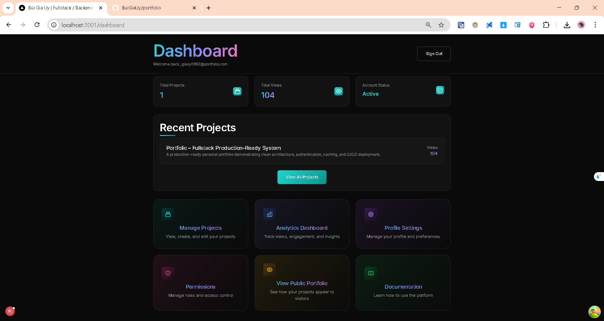
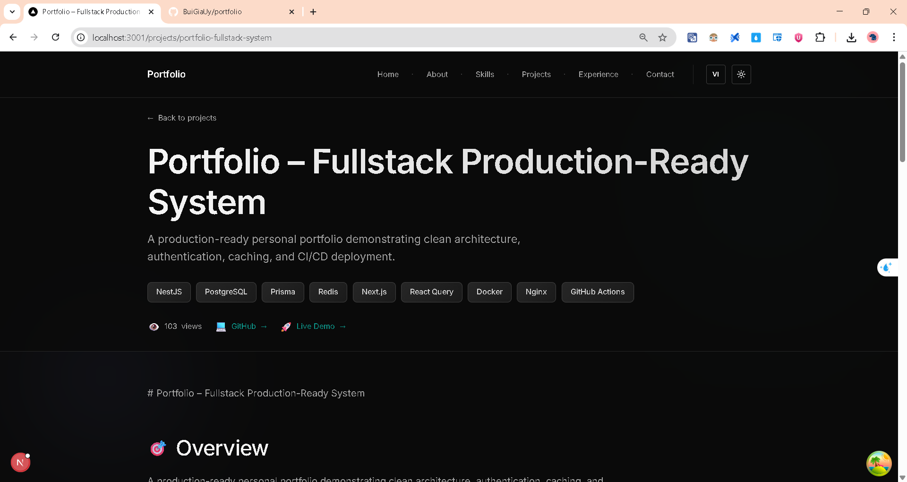

# 🚀 Portfolio - Production-Ready Fullstack System

<div align="center">



[](https://github.com/BuiGiaUy/portfolio/actions)
[](https://www.typescriptlang.org/)
[](https://nestjs.com/)
[](https://nextjs.org/)
[](https://www.postgresql.org/)
[](https://redis.io/)
[](https://www.docker.com/)

**A modern, production-grade portfolio application showcasing Clean Architecture,
real-time caching, JWT authentication, and comprehensive testing.**

[Live Demo](#) • [Documentation](#-documentation) • [Getting Started](#-quick-start)

</div>

---

## 📖 About

This portfolio system demonstrates enterprise-level software engineering practices through a fullstack application. Built with **Clean Architecture** principles, it features secure authentication, intelligent caching, comprehensive testing, and a robust CI/CD pipeline ready for production deployment.

### ✨ Key Highlights

| Feature                   | Description                                                    |
| ------------------------- | -------------------------------------------------------------- |
| 🏛️ **Clean Architecture** | Domain-driven design with clear separation of concerns         |
| 🔐 **Secure Auth**        | JWT tokens with HttpOnly cookies & refresh token rotation      |
| ⚡ **Smart Caching**      | Redis cache-aside pattern with automatic invalidation          |
| 🧪 **155+ Tests**         | Unit tests (148) + E2E tests (7) with full coverage            |
| 📊 **Observability**      | Sentry error tracking + structured logging                     |
| 🐳 **Docker Ready**       | Multi-stage builds for optimized production images             |
| 🔄 **CI/CD Pipeline**     | Automated testing, building, and deployment via GitHub Actions |
| 🌐 **i18n Support**       | English & Vietnamese multilingual support                      |

---

## 📸 Screenshots

### Homepage


_Modern landing page with animated hero section, skills showcase, and project highlights_

### Admin Dashboard


_Project management dashboard with analytics, CRUD operations, and real-time updates_

### Project Detail


_Detailed project view with tech stack badges, descriptions, and related projects_

---

## 🛠️ Tech Stack

### Backend

| Technology        | Purpose                    |
| ----------------- | -------------------------- |
| **NestJS 11**     | Scalable Node.js framework |
| **Prisma ORM**    | Type-safe database access  |
| **PostgreSQL 16** | Primary database           |
| **Redis 7**       | Caching & session storage  |
| **JWT**           | Authentication tokens      |
| **Sentry**        | Error monitoring           |

### Frontend

| Technology         | Purpose                      |
| ------------------ | ---------------------------- |
| **Next.js 15**     | React framework (App Router) |
| **React Query**    | Server state management      |
| **TypeScript 5**   | Type safety                  |
| **Tailwind CSS 4** | Utility-first styling        |

### Infrastructure

| Technology         | Purpose                        |
| ------------------ | ------------------------------ |
| **Docker**         | Containerization               |
| **Docker Compose** | Multi-container orchestration  |
| **Nginx**          | Reverse proxy & load balancing |
| **GitHub Actions** | CI/CD automation               |

---

## 🚀 Quick Start

### Prerequisites

- Node.js ≥ 18
- PostgreSQL ≥ 14
- Redis ≥ 6
- Docker (optional)

### Local Development

```bash
# Clone repository
git clone https://github.com/BuiGiaUy/portfolio.git
cd portfolio

# Backend setup
cd portfolio-backend
npm install
cp .env.example .env
npm run prisma:migrate
npm run prisma:seed
npm run start:dev

# Frontend setup (new terminal)
cd portfolio-frontend
npm install
cp .env.example .env.local
npm run dev
```

**Access Points:**

- 🌐 Frontend: http://localhost:3001
- 🔌 Backend API: http://localhost:3000
- 📚 API Docs: http://localhost:3000/api

### Docker Deployment

```bash
# Copy environment file
cp .env.example .env

# Build and run all services
docker compose up --build -d

# Check status
docker compose ps
```

---

## 🧪 Testing

```bash
# Backend tests (148 unit tests)
cd portfolio-backend
npm run test              # Unit tests
npm run test:e2e          # E2E tests
npm run test:cov          # Coverage report

# Frontend tests
cd portfolio-frontend
npm run test:e2e          # Playwright E2E tests
npm run test:e2e:ui       # Visual debugger
```

### Test Results

- ✅ **148 unit tests** passing
- ✅ **7 E2E tests** passing
- ✅ **0 security vulnerabilities**

---

## 📚 Documentation

| Document                                               | Description                 |
| ------------------------------------------------------ | --------------------------- |
| [ARCHITECTURE.md](./ARCHITECTURE.md)                   | System design & patterns    |
| [DEPLOYMENT.md](./DEPLOYMENT.md)                       | Production deployment guide |
| [E2E_AND_OBSERVABILITY.md](./E2E_AND_OBSERVABILITY.md) | Testing & monitoring        |

---

## 🔄 CI/CD Pipeline

Automated workflow triggered on push to `main`:

```
┌─────────────┐    ┌─────────────┐    ┌─────────────┐    ┌─────────────┐
│   Checkout  │ -> │  Run Tests  │ -> │ Build Image │ -> │   Deploy    │
│    Code     │    │  & Linting  │    │  Push Hub   │    │   to VPS    │
└─────────────┘    └─────────────┘    └─────────────┘    └─────────────┘
```

**Pipeline Steps:**

1. ✅ Install dependencies
2. ✅ Run backend tests (Jest)
3. ✅ Lint & typecheck frontend
4. ✅ Build Docker images
5. ✅ Push to Docker Hub
6. ✅ Deploy to production server

---

## 📊 Project Status

- ✅ Authentication & Authorization (JWT + Refresh Tokens)
- ✅ Project CRUD with optimistic updates
- ✅ Redis caching layer with auto-invalidation
- ✅ E2E testing suite (Jest + Playwright)
- ✅ Structured logging (JSON format)
- ✅ Error tracking (Sentry integration)
- ✅ CI/CD pipeline (GitHub Actions)
- ✅ Docker deployment ready
- ✅ i18n support (EN/VI)

---

## 🏗️ Architecture

```
portfolio/
├── portfolio-backend/          # NestJS API (Clean Architecture)
│   ├── src/
│   │   ├── domain/             # Entities, repositories interfaces
│   │   ├── application/        # Use cases, DTOs
│   │   ├── infrastructure/     # Database, cache, external services
│   │   └── interface/          # Controllers, guards, middleware
│   └── tests/                  # Unit & E2E tests
│
├── portfolio-frontend/         # Next.js 15 App Router
│   ├── app/                    # App router pages
│   ├── components/             # Reusable UI components
│   ├── lib/                    # Utilities, API clients
│   └── services/               # API service layer
│
├── nginx/                      # Reverse proxy configuration
├── docker-compose.yml          # Multi-container orchestration
└── .github/workflows/          # CI/CD pipeline
```

---

## 🤝 Contributing

1. Fork the repository
2. Create feature branch (`git checkout -b feat/amazing-feature`)
3. Follow Clean Architecture patterns
4. Write tests for new features
5. Run linters before committing
6. Submit a Pull Request

---

## 📄 License

MIT License - See [LICENSE](./LICENSE) file for details

---

<div align="center">

**Built with ❤️ by [Gia Uy](https://github.com/BuiGiaUy)**

[](https://github.com/BuiGiaUy)

</div>
